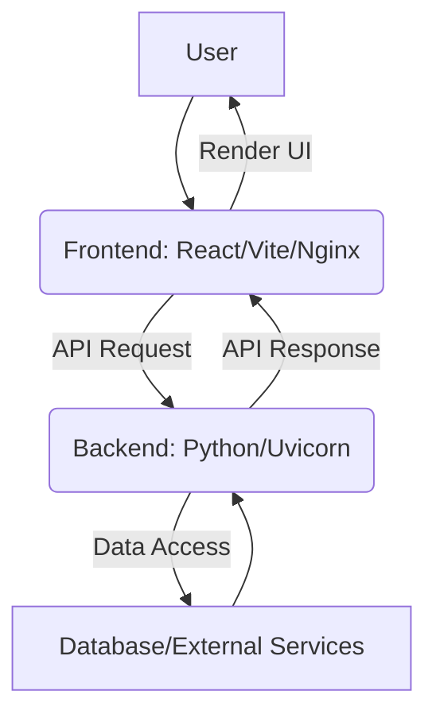

### Explanation of Application Flow:

*   **User**: This represents the end-user interacting with the application through a web browser.
*   **Frontend (React/Vite/Nginx)**: This is the client-side application built with React and Vite. It serves the user interface and handles user interactions. It is containerized and served by Nginx.
*   **API Request**: When the user performs an action that requires server-side data or processing (e.g., fetching data, submitting a form), the Frontend sends an API request (typically HTTP/S) to the Backend.
*   **Backend (Python/Uvicorn)**: This is the server-side application built with Python. It receives and processes API requests from the Frontend. It is served by Uvicorn and runs in its own Docker container.
*   **Data Access**: The Backend interacts with data sources or external services to fulfill the request. This could involve querying a database, calling another API, or performing complex computations.
*   **Database/External Services**: This represents any persistent storage (like a database) or third-party services that the Backend communicates with.
*   **API Response**: After processing, the Backend sends a response back to the Frontend, usually containing data in JSON format or a status confirmation.
*   **Render UI**: The Frontend receives the API Response and updates the user interface accordingly, displaying new data or confirming actions to the User.