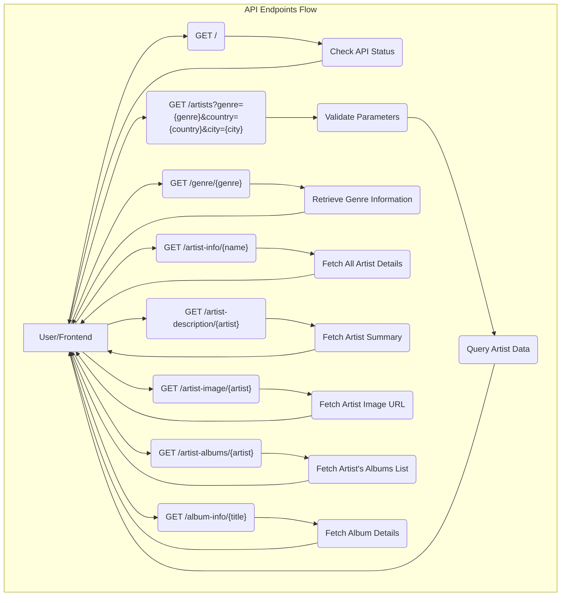

### Explanation of Backend API Flow:

This Mermaid diagram illustrates the general process flow for each endpoint in the backend API. For clarity, a simplified flow is shown for each `GET` request, originating from a 'User/Frontend' and returning a response. Each endpoint involves:

1.  **Request Initiation**: A user action on the frontend triggers an HTTP GET request to a specific backend endpoint.
2.  **Endpoint Processing**: The backend application receives the request at the designated endpoint.
3.  **Data Retrieval/Logic**: The backend executes specific logic, which may involve validating parameters, querying internal data sources (e.g., a database), or interacting with external services to gather the necessary information.
4.  **Response**: The backend compiles a response, typically in JSON format, containing the requested data or a status message. This response is then sent back to the frontend.

Here's a breakdown by endpoint:

*   **`GET /` (Root)**: A basic endpoint to confirm the API is operational, returning a simple message.
*   **`GET /artists?genre={genre}&country={country}&city={city}` (Get Artists by Location and Genre)**: This endpoint receives location and genre parameters, validates them, and queries for an artist matching these criteria.
*   **`GET /genre/{genre}` (Get Information by Genre)**: Retrieves detailed information associated with a given genre.
*   **`GET /artist-info/{name}` (Get Artist Information)**: Fetches all available details for a specified artist.
*   **`GET /artist-description/{artist}` (Get Artist Description)**: Retrieves only the summary or description for an artist.
*   **`GET /artist-image/{artist}` (Get Artist Image)**: Fetches the image URL for a specified artist.
*   **`GET /artist-albums/{artist}` (Get Artist's Albums)**: Fetches a list of albums associated with a specific artist.
*   **`GET /album-info/{title}` (Get Album Information)**: Fetches detailed information for a specific album title.