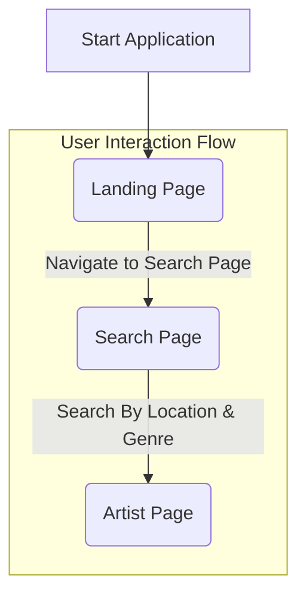

### Explanation of Frontend Pages Flow:

This Mermaid diagram illustrates the basic navigation flow between the main pages of the frontend application:

*   **Start Application**: This represents the initial loading of the frontend application, which typically lands the user on the Home Page.
*   **Home Page**: This is the main entry point of the application, often displaying introductory information or general content. From here, users can navigate to other sections.
*   **Navigate to Search**: Users can typically navigate from the Home Page to the Search Page, likely via a navigation link, button, or search bar.
*   **Search Page**: This page allows users to search for artists based on both location and genre, this will provide a list of artists that fit the search criteria.
*   **Artist Page**: When a user clicks an artist, the user is presented a search page with general information about the artist.
